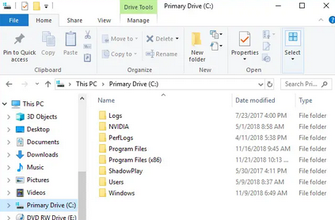

# Windows font modifier

Bored of the default font? Change it.

## Check what fonts you have
- Windows menu bar: search "font" > font settings
- Available Fonts > Type here to Search
- If you don't have it install them by getting the `.ttf` files
- Right-click `.ttf` file > Install

## Modify your fonts
- Right-click `install-font.reg` > Edit
- Change the line at `"Segoe UI"="Consolas"` in `"install-font.reg"` do a desired font installed on your computer
- Save

## Change font
- Right-click `install-font.reg`
- Merge
- Restart computer

## Revert changes

- Right-click `uninstall-font.reg`
- Merge
- Restart computer

## Reset
- font changes are harmless but if you mess up, just reset the changes
- Right-click `default.fonts.reg`
- Merge
- Restart computer

Default (Segoe UI)
- 

Noto Sans Mono
- `"Segoe UI"="Noto Sans Mono"`
- 

Consolas
- `"Segoe UI"="Consolas"`
- 

Jetbrains Mono
- `"Segoe UI"="JetBrains Mono"`
- 